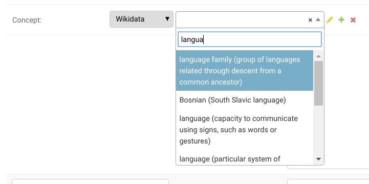
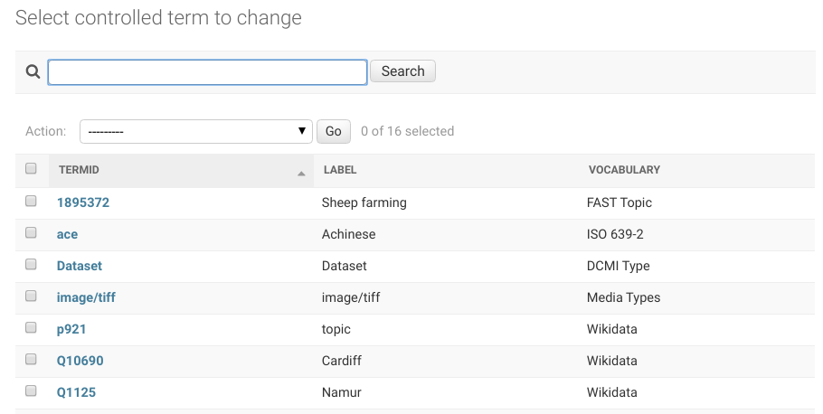

[](https://badge.fury.io/py/django-controlled-vocabulary)

# Django Controlled Vocabulary

Facilitates linkage to remote standard vocabularies (e.g. language codes, wikidata)
within the Django Admin to increase the consistency and understandability of your project data.

Development Status: **Alpha** (only partly functional, work in progress)



# Features

* Lets you create your own controlled lists of terms (i.e. **local** lists)
* look up terms from **remote** vocabularies (i.e. authority lists)
* **plug-in architecture** for lookups into particular vocabularies
* Built-in vocabulary plug-ins, such as ISO 639-2 (Language codes), DCMI Type (Dublin Core resource types)
* **stores** used terms from remote vocabularies into the database:
  * space efficient (don't clutter the database with unused terms)
  * self-contained (i.e. can still works offline & DB always 'semantically' complete)
* [TODO] possibility to store additional **metadata** (e.g. geographic coordinates)
* [TODO] simple **rest API** to publish your own terms
* New Django model field with **autocomplete** widget

# Data Model & Software Design

## Django models

| Vocabularies | Terms |
| ------------- | ------------- |
|   |   |

* ControlledVocabulary
  * prefix: the vocabulary standard prefix, see http://prefix.cc/wikidata
  * label: the short name of the vocabulary
  * base_url: the url used as a base for all terms in the vocabulary
  * concept: the type of terms this vocabulary contains
  * description: a longer description

* ControlledTerm
  * termid: a unique code for the term within a vocabulary
  * label: standard name for the term
  * vocabulary: the vocabulary this term belongs to

## Vocabulary plug-ins / managers

A Vocabulary **plug-in** / **manager** is a python class that provides services for a vocabulary:
* autocomplete terms from local or remote datasets (see ControlledTermField)
* supplies metadata for the vocabulary (see ControlledVocabulary)

Managers can provide terms from a CSV file downloaded from an authoritative source.

Some vocabularies can contain thousands of terms or more. A plugin will
only insert the terms used by your application. The rest will be accessed on
demand from a file on disk or in a third-party server. This approach saves
database space and keeps your application data self-contained.

This project comes with built-in plugins for the following vocabularies:
ISO 639-2, DCMI Type, Wikidata, FAST Topics, MIME, Schema.org

Those plugins are **enabled** by default; see below how to selectively enable them.

This architecture allows third-party plugins to be supplied via separate
python packages.

# Limitations
* **controlled list** rather than fully fledged vocabularies, (i.e. just a bag of terms with unique IDs/URIs, no support for taxonomic relationships among terms like broader, narrower, synonyms, ...)
* no notion of granularity (e.g. geonames country, region, city, street are all treated as part of the same vocabulary)

# Setup

## Installation

Install into your environment:

```
pip install django-controlled-vocabulary
```

Add the app to the INSTALLED_APPS list in your Django settings file:

```
INSTALLED_APPS = [
    # other apps
    'controlled_vocabulary',
]
```

Run the migrations:

```
./manage.py migrate
```

Download vocabulary data and add metadata to the database:

```
./manage.py vocab init
```

## Configuration

### Enabling vocabulary plug-ins

Add the following code in your settings.py to enable specific vocabularies based on the import path of their classes.

```
# List of import paths to vocabularies lookup classes
CONTROLLED_VOCABULARY_VOCABULARIES = [
    'controlled_vocabulary.vocabularies.iso639_2',
    'controlled_vocabulary.vocabularies.dcmitype',
]
```

### ControlledTermField

To define a field with an autocomplete to controlled terms in your Django Model, use the following field:

```
from controlled_vocabulary.models import ControlledTermField
```

```
    language_code = ControlledTermField(
        'iso639-2',
        null=True, blank=True
    )
```

Where 'iso639-2' is the prefix of a controlled vocabulary in your database.

# vocab (command line tool)

vocab is a django command line tool that lets you manipulate the vocabularies
and the plugins. To find out more use the help:

```
./manage vocab help
```

